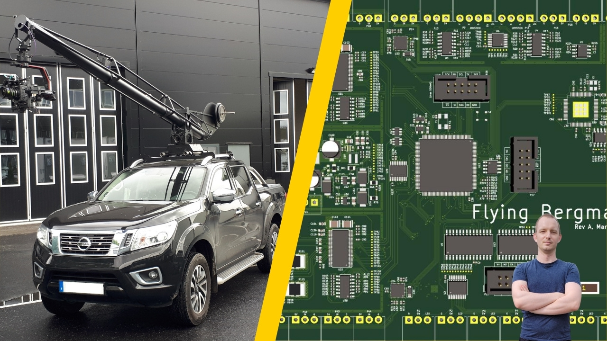

# CraneControl - Movie Production Crane Firmware

This repository includes original implementation of the CraneControl firmware
for controlling FlyingBergman movie production camera crane.

This firmware is based on FreeRTOS and this repository is provided for
historical and learning purposes.

The crane has been in active use since 2019 and has been the primary camera
crane used to film several Swedish movie series - most notably 2022 Netflix
series "Clark".

The software in this repository runs on the [CraneControl PCB
design](https://github.com/swedishembedded/cranecontrol-hw) which has dual
function as both HMI panel and motor control board (two boards can be connected
over CANOpen and communicate in this way).

## Results

## Building

	./autogen.sh
	mkdir build && cd build
	../configure --host=arm-none-eabi --with-devicetree=../dts/flyingbergman.dts
	make
	make flash

## License

This project contains code in it that is provided under several different open
source licenses. Most notably GPLv2 and GPLv3. If no license information is
provided in the file, you should treat that file as GPLv2-or-later. Otherwise
refer to individual files for license details.

